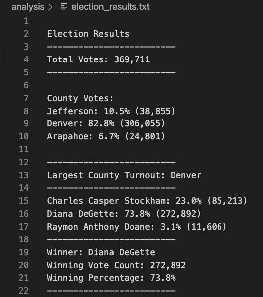

# **Module3 Challenge - Election-Analysis**

## **Overview of the Project**

#### The purpose of this project is to complete an election audit of a recent local congressional election and analyze the election results by county and by candidates.

#### The source data that is used for this project contains Ballot ID, County, and Candidate Names of three counties and three candidates.

## **Election-Audit Results**

### **The project was designed to answer the following election outcomes:**

#### - The number of votes that were cast in this election.
#### - Number and percentages of votes for each county.
#### - Determine county with the largest number of votes.
#### - Number and percentages of votes for each candidate.
#### - The winning candidate, his/her vote count, and vote percentage of total votes.

### **The Python codes that were used in this project:**

#### [Election Analysis Results](https://github.com/davidzachie/Module3-election-analysis/commit/8ed43d304134c57fa418f49ea1d9f25e68113756)

### **Election Results saved to text file that shows the election outcomes:**

## **Election Audit Summary**

#### This Python script can be modified and used to find the number of votes and votes percentages for other categories 

